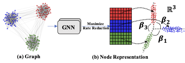
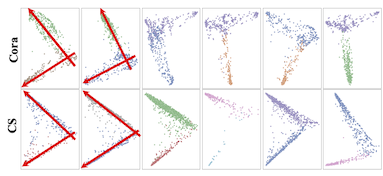

# Geometric Graph Representation Learning via Maximizing Rate Reduction

Implementaion for WWW2022 paper Geometric Graph Representation Learning via Maximizing Rate Reduction [[proceedings]](https://dl.acm.org/doi/10.1145/3485447.3512170) [[arxiv]](https://arxiv.org/abs/2202.06241).

## 1. Introduction

We propose **G**eometric **G**raph **R**epresentation Learning ($\mathrm{G}^2\mathrm{R}$) to learn node representations in an unsupervised manner via maximizing rate reduction. In this way, $\mathrm{G}^2\mathrm{R}$ maps nodes in distinct groups (implicitly stored in the adjacency matrix) into different subspaces, while each subspace is compact and different subspaces are dispersedly distributed. $\mathrm{G}^2\mathrm{R}$ adopts a graph neural network as the encoder and maximizes the rate reduction with the adjacency matrix. Furthermore, we theoretically and empirically demonstrate that rate reduction maximization is equivalent to maximizing the principal angles between different subspaces.





## 2. Examples
1. We provide a [Jupyter Notebook](src/orthogonality_visualization_figure3_in_the_paper.ipynb) to reproduce the orthogonality visualization results (Figure 3) in Section 5.3, which shows the (nearly) orthogonality of
node representations in the two classes.



2. We also provide the trianing log on Cora dataset in the [Jupyter Notebook](src/orthogonality_visualization_figure3_in_the_paper.ipynb).


## 3. Run

1. Requirements

```txt
torch==1.7.1
torch_geometric==1.6.3
```


2. Data

We use the dataset built in torch_geometric. The dataset will be downloaded automatically.


3. Run Experiments
   run the following examples on Cora, CiteSeer, PubMed dataset.

```bash
python -u G2R.py --dataset Cora --num_epochs 20 --num_layers 1 --num_node_batch 768 --num_hidden 1024 --num_out 512 --gam1 0.5 --gam2 0.5 --eps 0.05 --seed 21415 --split fixed
```

```bash
python -u G2R.py --dataset CiteSeer --num_epochs 20 --num_layers 1 --num_node_batch 512 --num_hidden 1024 --num_out 512 --gam1 0.5 --gam2 0.5 --eps 0.1 --seed 21415 --split fixed
```

```bash
python -u G2R.py --dataset PubMed --num_epochs 40 --num_layers 1 --num_node_batch 200 --num_hidden 1024 --num_out 512 --gam1 0.5 --gam2 0.5 --eps 0.05 --seed 21415 --split fixed
```


## 4. Acknowledgments

The basic technique used in our paper originated from [Learning diverse and discriminative representations via the principle of maximal coding rate reduction](https://proceedings.neurips.cc/paper/2020/file/6ad4174eba19ecb5fed17411a34ff5e6-Paper.pdf), Yu, Yaodong, Kwan Ho Ryan Chan, Chong You, Chaobing Song, and Yi Ma, NeurIPS2020.
We would like to thank the authors for their great paper, which inspires me.

## 5. License

MIT

## 6. Cite Our Paper

If you use this code in your research, please cite our paper.

```
@inproceedings{han2022geometric,
  title={Geometric Graph Representation Learning via Maximizing Rate Reduction},
  author={Han, Xiaotian and Jiang, Zhimeng and Liu, Ninghao and Song, Qingquan and Li, Jundong and Hu, Xia},
  booktitle={Proceedings of the ACM Web Conference 2022},
  pages={1226--1237},
  year={2022}
}
```